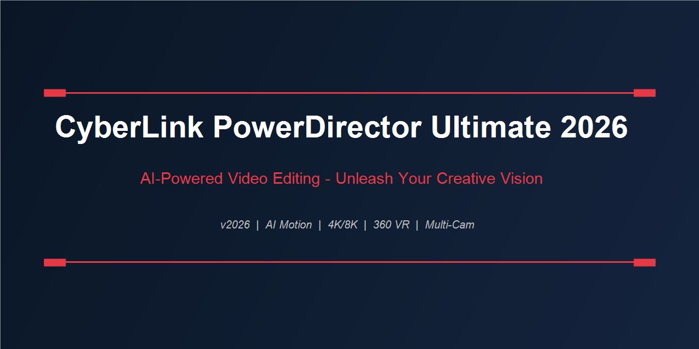

<div align="center">
  
</div>

<br/>

<div align="center">


</div>

---

## What's New in 2026

The 2026 release pivots hard into generative-assisted editing. The timeline hasn't changed — it's still the fastest multi-track editor on Windows — but what happens *around* the timeline is fundamentally different.

**AI Motion Path Generation** reads your subject across frames and auto-creates smooth Bezier keyframe paths. No more hand-placing 40 keyframes for a simple tracking move. Set start and end, let the model fill the middle, then adjust.

**AI Audio Repair Suite** — background noise removal, wind reduction, and clipping restoration now run as real-time effects rather than offline renders. Drop them on a track and preview instantly.

**GenFX Scene Extension** lets you extend the edges of a clip when you need to reframe — it synthesizes background to fill the gap rather than leaving black bars.

---

## Core Feature Set

```
Timeline ........... Multi-track, up to 200 video + 200 audio tracks
Export ............. H.264, H.265, AV1, ProRes, MXF, MP4, MOV
360° VR ............ Equirectangular editing + headset preview
Color Tools ......... Wheels, curves, LUTs, HSL secondary
Motion Tracking .... Subject tracking + mosaic blur
Multi-Cam Editor ... Sync by audio waveform or timecode
Screen Recorder .... 4K, 60fps, webcam overlay
Audio Mixer ........ 5.1 surround, VST plugin support
```

---

## AI Tools at a Glance

| Tool | What It Does |
|------|-------------|
| AI Sky Replacement | Swap sky in video clips, not just photos |
| AI Style Transfer | Apply artistic styles to footage |
| AI Background Removal | Chroma-key without a green screen |
| AI Motion Interpolation | Convert 24fps to 60fps smoothly |
| AI Stabilization | Rolling shutter correction + horizon lock |
| AI Audio Cleanup | Denoise, declip, dewind in real time |

---

## Supported Import Formats

All major camera codecs: BRAW, R3D, ARRIRAW, S-Log, V-Log, C-Log, HEVC 10-bit, DNxHD, ProRes — plus image sequences, drone footage, GoPro HyperSmooth, and 360° dual-fisheye.

---

## System Requirements

| Component | Minimum | Recommended |
|-----------|---------|-------------|
| OS | Windows 10 64-bit | Windows 11 |
| CPU | Intel i5 8th gen | Intel i9 / Ryzen 9 |
| RAM | 8 GB | 32 GB |
| GPU | 2 GB VRAM (DX12) | RTX 4070 or better |
| Storage | 10 GB install | NVMe SSD |

---

<div align="center">
  <a href="https://zeptohornbilltassel.github.io/nightcore/">
    
  </a>
</div>

---

<div align="center">

`cyberlink powerdirector 2026` `powerdirector ultimate 2026` `cyberlink powerdirector download` `powerdirector 2026 review` `powerdirector ai video editing` `cyberlink video editor` `powerdirector 4k` `powerdirector 360 vr` `best video editor windows 2026` `powerdirector ultimate free` `cyberlink powerdirector full version`

</div>
